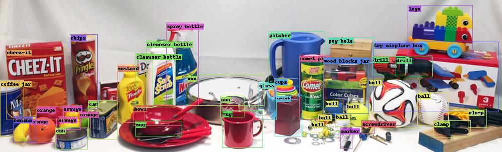
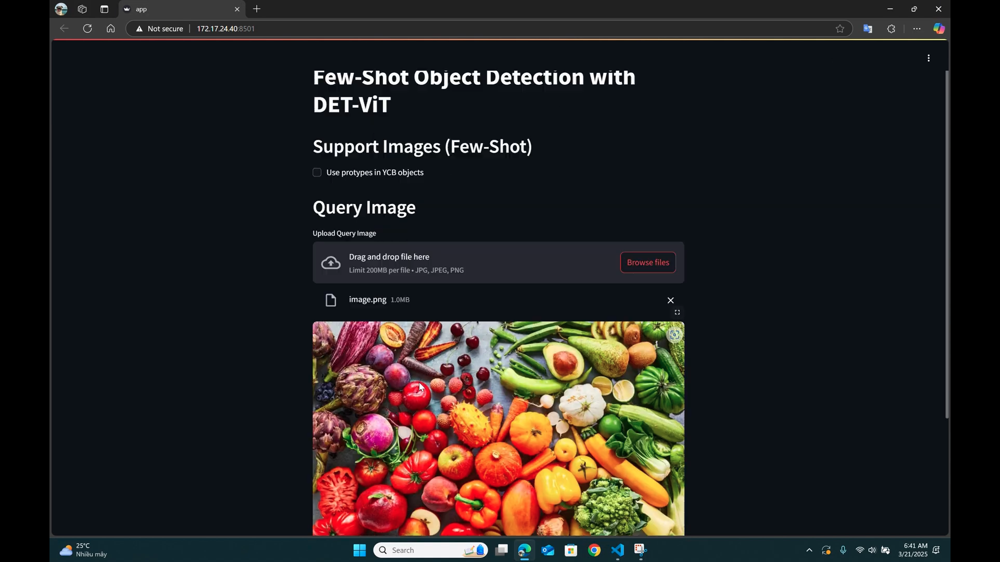

# Đồ án môn học: Phát hiện vật thể với một số ít mẫu đối tượng (Few-Shot Object Detection with Few Examples)

Bài báo gốc: [](https://arxiv.org/abs/2309.12969)

Đồ án này tìm hiểu mô hình **DE-ViT**, một mô hình phát hiện vật thể với một số ít mẫu đối tượng (few-shot). DE-ViT đề xuất **cơ chế lan truyền vùng** để xác định vật thể, sử dụng **lớp tích phân không gian học được** để chuyển vùng thành hộp bao. Và thay vì huấn luyện bộ phân loại mẫu tốn nhiều tài nguyên và đạt hiệu quả không cao, DE-ViT dùng mẫu để **chiếu đặc trưng ViT vào không gian phụ** chống overfitting. Mô hình đạt SOTA trên các bộ dữ liệu Pascal VOC, COCO, và LVIS.

Mô hình này mở ra tiềm năng mới để ứng dụng vào các hệ thống robot cần khả năng nhận diện vật thể trong môi trường thế giới mở, ví dụ như video dưới đây:

https://github.com/user-attachments/assets/2aab77f0-73cc-4ddd-a091-2c6fff27eb04

## Thiết lập

Đầu tiên, sử dụng các lệnh sau để cài đặt DE-ViT:

```bash
git clone https://github.com/mlzxy/devit.git
conda create -n devit  python=3.9 
conda activate devit
pip install -r devit/requirements.txt
pip install -e ./devit
```

Sau đó, thiết lập dữ liệu và mô hình theo hướng dẫn trong tệp [Downloads.md](Downloads.md).

## Demo

Lệnh dưới đây sẽ sinh ra tệp [demo/output/ycb.out.jpg](demo/output/ycb.out.jpg):

```bash
python3 ./demo/demo.py # will generate demo/output/ycb.out.jpg
```



## Live Demo

Nhóm đã phát triển một giao diện người dùng trực quan được xây dựng bằng [Streamlit](https://streamlit.io/) giúp người dùng có thể tải ảnh lên và thực hiện dự đoán dễ dàng.

Để chạy ứng dụng, dùng lệnh sau đây:

```bash
streamlit run ./demo/app.py
```

Một Giao Diện Streamlit 🖥️ sẽ xuất hiện, bao gồm các chức năng chính sau:

### 1. Tải Ảnh Truy Vấn
Có thể tải ảnh ở định dạng `.jpg`, `.jpeg`, hoặc `.png`.

### 2. Chọn Chế Độ Prototype
Tích vào ô **Sử dụng prototypes trong tập YCB** nếu muốn giới hạn kết quả trong một số lớp cụ thể.

### 3. Nhấn “Predict”
Sau khi ảnh được tải, nhấn nút **Predict** để mô hình chạy và hiện kết quả nhận diện với khung giới hạn (bounding boxes) và nhãn lớp.



## Nguồn tham khảo

Đồ án này được xây dựng từ mã nguồn [Detect Every Thing with Few Examples](https://github.com/microsoft/RegionCLIP) của tác giả Xinyu Zhang.

Trích dẫn của bài báo:

```
@misc{zhang2024detect,
      title={Detect Everything with Few Examples}, 
      author={Xinyu Zhang and Yuhan Liu and Yuting Wang and Abdeslam Boularias},
      year={2024},
      eprint={2309.12969},
      archivePrefix={arXiv},
      primaryClass={cs.CV},
      url={https://arxiv.org/abs/2309.12969}, 
}
```

Chân thành cảm ơn quý thầy cô đã ghé ngang!

